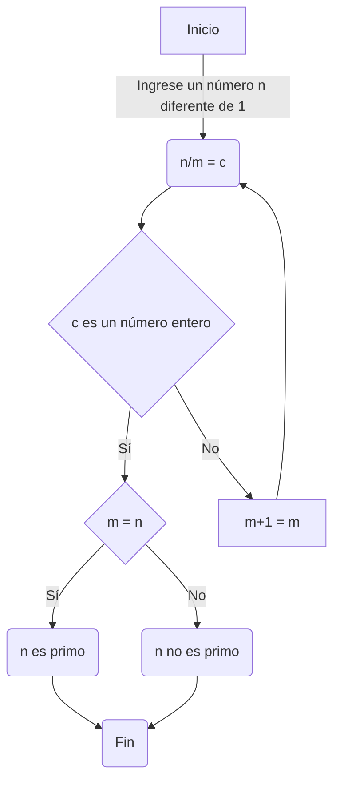
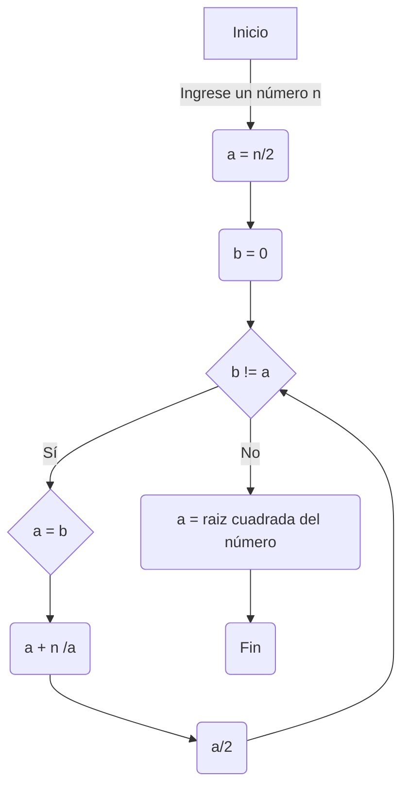

# Diagramas de Flujo Reto 2 y 3
<table cellspacing="1" bgcolor="">
  <tr bgcolor="#252582">
    <th><b>Reto 2</b></th>
  </tr>
  <tr bgcolor="#e4e4ed">
    <td style="color:#141414" align="center">A partir del algoritmo de identificación de los divisores plantear la serie de pasos para determinar los números primos hasta un natural n.</td>
  </tr>
</table>

Algoritmo planteado

<table cellspacing="1" bgcolor="">
  <tr bgcolor="#252582">
    <th><b>Reto 3</b></th>
  </tr>
  <tr bgcolor="#e4e4ed">
    <td style="color:#141414" align="center">Revise el procedimiento matemático para hallar raíces cuadradas (son divisiones y restas), plantee el algoritmo en pseudocódigo y en diagrama de flujo.</td>
  </tr>
</table>

<b>Método Newton-Raphson</b>

El algoritmo planteado se basa en el método Newton-Raphson desarrollado por dos matemáticos de manera independiente en el siglo XVII. Este método es una técnica de iterativa que se utiliza para aproximar raíces de una función, en el caso del reto, la raíz cuadrada. Este procedimiento comienza con la suposición de una raíz y luego se mejora repetidamente esta suposición utilizando la regla de la tangente de la curva de la función en el punto actual; lo cual nos da como resultado la formula de iteración del método Newton-Raphson:

 x_n+1=x_n-f(x_n )/(f^' (x_n ) )

Lo cual se traduce en:

x_n+1=(x_n+m/x_n )/2

Donde:

<ul type="circle">
  <li>x_n es la suposición actual de la raíz cuadrada.</li>
  <li>x_(n+1 ) es la siguiente aproximación de la raíz cuadrada.</li>
  <li>m es el número del cual se quiere calcular la raíz cuadrada.</li>
</ul>

Isaac Newton, uno de los científicos más influyentes de la historia, postuló esté método como una técnica para encontrar raíces de ecuaciones en su obra "Método de las Fluxiones" (escrita alrededor de 1669). Sin embargo, Newton nunca publicó formalmente sus trabajos de método numéricos y cálculo en su tiempo. Por otro lado, Joseph Raphson, un matemático y teólogo inglés, fue el primero en publicar formalmente el método de Newton en su libro "Análisis Aritmético" (1690), lo que le valió el reconocimiento por este método y llevó a que se le conociera con su nombre.

Algoritmo planteado:

